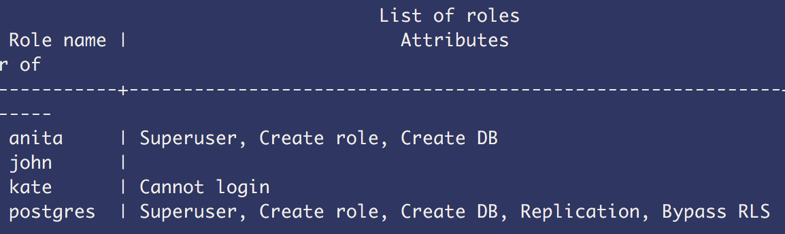
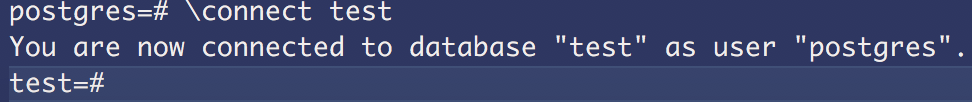
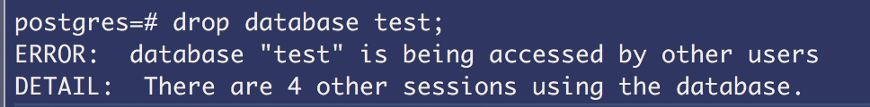
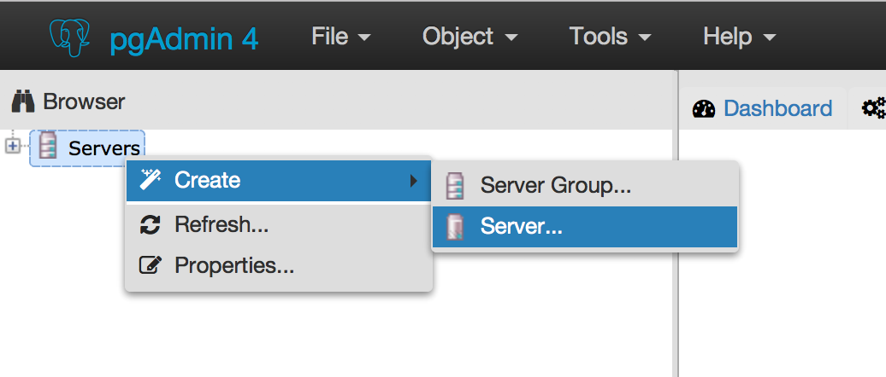
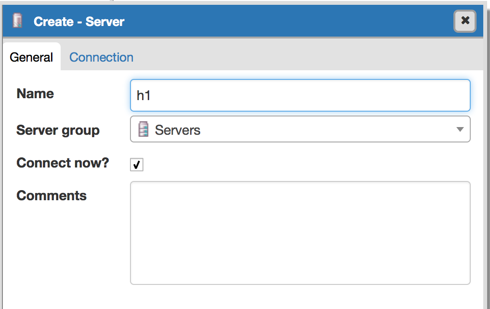
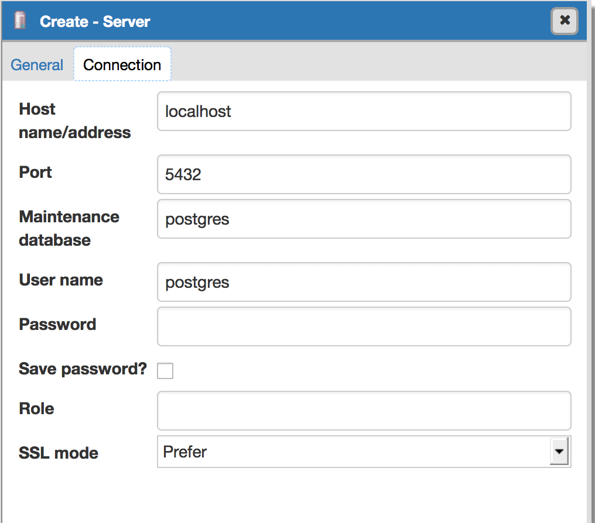
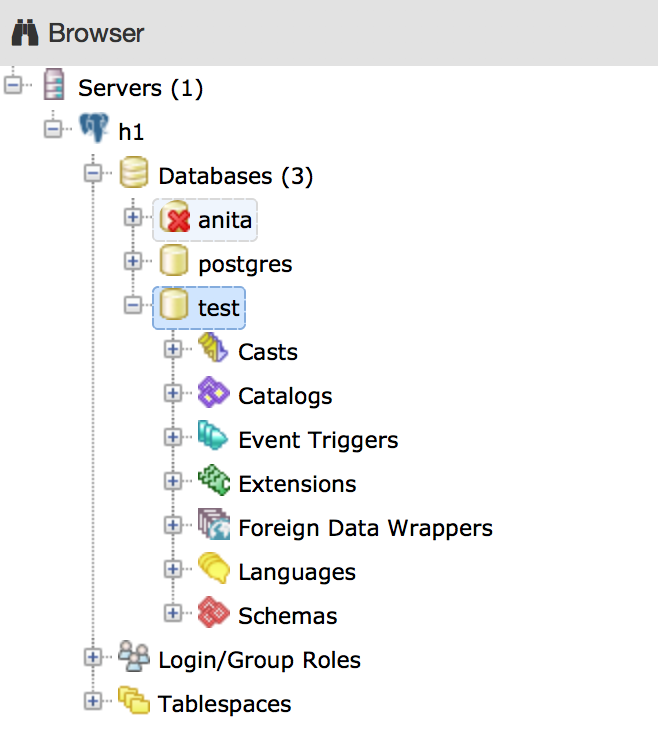

## How to start with Postgresql

## Installation on Mac

There are a couple of ways of installing postgres on your machine:
- by http://postgresapp.com/
- by http://www.enterprisedb.com/products-services-training/pgdownload#macosx
- by Homebrew

I will demonstrate the first option (note that this option will create two databases by default: your **username** and **postgres**. Conventional way only creates one which is **postgres**, see https://github.com/PostgresApp/PostgresApp/issues/275):

- navigate to http://postgresapp.com/
- click download, unzip it
- move the **elephant icon** into **Applications** folder
- double click elephant icon from **Applications** folder, click **open psql**

You should see terminal as following:


You can use command line to run your postgres by adding the following line to **nano ~/.bash_profile:** (default shell in OS X) or **nano ~/.zshrc**:

```export PATH=$PATH:/Applications/Postgres.app/Contents/Versions/latest/bin```

After either close and open terminal tab or ```source ~/.zshrc or .bash_profile``` or  for the bash script to include last modification.

You can now check if the path is set up correctly by typing ```which psql```.

### Connecting to a database

To start up psql type ```psql``` which is a default command to ```psql -h localhost```


There are two default databases, your username and postgres. If you wonder why we have both, refer to this issue https://github.com/PostgresApp/PostgresApp/issues/275.

To start up specific database, type: ```psql name_of_the_database```, e.g: ```psql postgres```

You can also explicitly specify if you want to enter a password **-W** or not **-w**, like:

```js
$ psql -w postgres
$ psql -W postgres
Password:
```
### User Management

View current roles defined in Postgresql, type: ```\du``` like below:


By default, **postgres** is typically the only user that exists, in my case I have two default users (postgres.app installation behaviour) **anita** and **postgres**.

Log as the postgres user: ```psql -U postgres```

As you can see we already have two users, but if you wish to create a new user, you have two options for creating users, either from the shell via ```createuser``` or via SQL ```CREATE ROLE```.
It is important to understand that users and roles are the same thing.

**Create a new user with LOGIN attribute**:

```postgres=# CREATE ROLE john LOGIN;```

**Create a new user with no attributes**:

```postgres=# CREATE ROLE kate;```

To check this out, type: ```\du```



**Check specific user, type**:

```\du kate```


**Alter roles**:

```postgres=# ALTER ROLE kate LOGIN;```

**Remove user/role**:

```postgres=# DROP ROLE kate;```

### Create new database

```postgres=# create database test;```

To check if the new database has been created, type: ```\l```

Example:


In gui-tool:
- click on the top bar: **localhost** to see all databases:


**Grant privileges on database test to new user**:

```postgres=# GRANT ALL PRIVILEGES ON DATABASE test TO john;```

**Change database:**



**Create table:**

```CREATE TABLE COMPANY(
   ID INT PRIMARY KEY     NOT NULL,
   NAME           TEXT    NOT NULL,
   AGE            INT     NOT NULL,
   ADDRESS        CHAR(50),
   SALARY         REAL
);```


**Remove database**

```postgres=# DROP DATABASE test;```

You might see this issue:



To resolve it:

- open gui postico, click on the database you wish to DROP, open sql query and type:

```js
SELECT pg_terminate_backend(pg_stat_activity.pid)
FROM pg_stat_activity
WHERE pg_stat_activity.datname = ‘TARGET_DB’
  AND pid <> pg_backend_pid();
```

- you can now delete the db, either in gui or in the terminal.

### Terminate psql

Terminate connection: ```control + Z```

Then quit the app.

### Start postgres again

Go to Applications double click on elephant icon to open psql.

In your terminal you can now use: ```psql```


### Installing GUI tool on Mac

List of GUI Tools http://postgresapp.com/documentation/gui-tools.html

#### postico

- navigate to https://eggerapps.at/postico/
- click download, unzip it
- move the icon to **Applications**
- double click on the **postico icon** to install it

You should see the following window:


- click **connect**

#### pgadmin

- navigate to https://www.postgresql.org/ftp/pgadmin3/pgadmin4/v1.1/macos/
- click latest version


- unzip it, agree to the licence
- move the pgadmin to the Applications folder
- close the pgadmin window

### Connect pgadmin to your server

- click on server - create - server (or groups depends what you need)



- define the name for your server (can be anything)



- add localhost to the host or remote address



- view your local databases



That's it, play around how to create new database, new user.


### Installation on Linux

 - http://www.techrepublic.com/blog/diy-it-guy/diy-a-postgresql-database-server-setup-anyone-can-handle/


### References:
- cheat sheet http://www.postgresonline.com/downloads/special_feature/postgresql83_psql_cheatsheet.pdf

- https://blog.risingstack.com/node-js-database-tutorial/
- uninstall http://stackoverflow.com/questions/8037729/completely-uninstall-postgresql-9-0-4-from-mac-osx-lion
